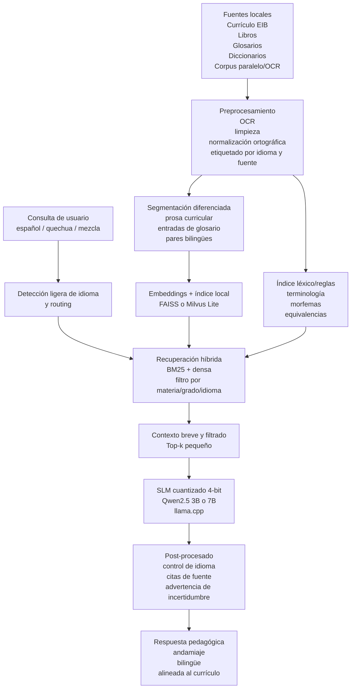
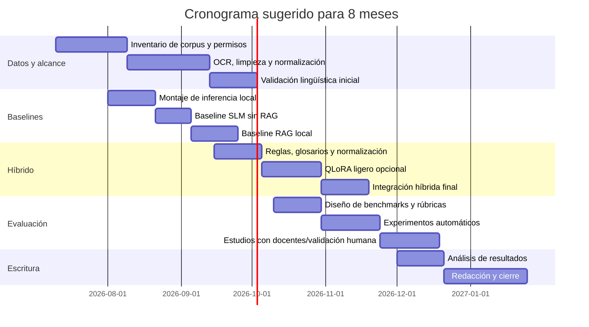

# Informe comparativo para la decisión metodológica de la tesis sobre español y Quechua Collao

## Resumen ejecutivo

El propio plan de tesis ya delimita un artefacto **offline**, orientado a **asistencia educativa bilingüe**, que **no entrena un modelo base desde cero** y que propone un **SLM cuantizado a 4 bits con RAG local** sobre materiales curriculares y glosarios; esa delimitación es coherente con el estado del arte y, de hecho, ya apunta en la dirección técnicamente más defendible para una tesis aplicada de pregrado. fileciteturn0file4

La síntesis de evidencia reciente favorece claramente una decisión en dos niveles. La **vía principal recomendada** para la tesis no debería ser el entrenamiento completo ni el fine-tuning profundo de un modelo pequeño para “volverlo bilingüe” en Quechua Collao, sino un **enfoque híbrido**: **SLM preentrenado cuantizado + RAG local + adaptación ligera y control lingüístico explícito**. En términos prácticos, eso significa que la tesis debe implementar como núcleo un sistema tipo **B**, pero con una capa de mejora **C**: reglas, glosarios, diccionarios, normalización ortográfica y, si el corpus realmente alcanza, un ajuste ligero tipo LoRA/QLoRA sobre tareas muy acotadas. citeturn31academia3turn5academia0turn5academia1turn4academia0turn1academia1

La razón principal es de **escala de datos y riesgo metodológico**. En lenguas de bajos recursos, los LLM/SLM generalistas muestran limitaciones importantes para traducción y comprensión profunda; además, el conocimiento factual nuevo se integra con dificultad mediante fine-tuning cuando el corpus es pequeño, y puede aparecer olvido catastrófico. En cambio, RAG permite alojar el conocimiento curricular fuera de los pesos del modelo, actualizarlo sin reentrenar y reducir alucinaciones si la recuperación y el contexto están cuidadosamente diseñados. citeturn1academia1turn31academia3turn31academia1turn27academia1turn7academia3

La evidencia, sin embargo, **no avala un “RAG puro” ingenuo**. En educación offline con modelos pequeños, se ha observado que el rendimiento cae cuando el contexto recuperado es largo, ruidoso o mal fragmentado. Por eso, la recomendación no es “poner un vector DB y listo”, sino **RAG disciplinado**: chunking corto, recuperación híbrida, filtros de relevancia, top-k pequeño, y plantillas de prompt que obliguen a citar o apoyarse en el contexto recuperado. citeturn5academia1turn4academia1turn8academia1

Para una tesis con foco en **asistencia educativa EIB offline**, la jerarquía de decisión más defendible es la siguiente: **C como solución objetivo**, **B como baseline implementable y defendible**, y **A como brazo comparativo limitado**. Dicho de otro modo: la tesis debería probar si un ajuste ligero aporta algo medible sobre el baseline RAG; no debería asumir, de partida, que la mejor inversión es “entrenar el modelo”. citeturn31academia2turn31academia1turn5academia0turn5academia1

## Punto de partida del plan y criterio de decisión

El plan subido plantea un asistente educativo bilingüe español–Quechua Collao, orientado a primaria y secundaria básica, con operación textual offline, detección de idioma, enrutamiento lingüístico, recuperación de contenido curricular local y generación pedagógica sobre un SLM cuantizado. Además, el documento enfatiza explícitamente que el alcance **no incluye entrenar un modelo desde cero**, sino **seleccionar, cuantizar y configurar** un modelo preentrenado e integrarlo con RAG local. Esa formulación es importante porque evita sobredimensionar la tesis y la alinea con una ruta experimental realista. fileciteturn0file4

La tesis también restringe correctamente el problema al **Quechua Collao**, y no a “quechua en general”. Esa delimitación es metodológicamente crucial: en traducción y en asistencia educativa, mezclar sin control datos de Ayacucho/Chanka, Cusco y Collao puede elevar cobertura aparente, pero reducir pertinencia lingüística y cultural. El plan, además, reconoce como limitaciones la escasez de corpus, el acceso territorial para validación y la necesidad de evaluación por especialistas EIB y hablantes competentes. fileciteturn0file4

A partir de ese marco, el criterio de decisión correcto no es “qué enfoque parece más potente en abstracto”, sino **qué enfoque entrega mejor combinación de exactitud, pertinencia pedagógica, viabilidad offline, costo y defendibilidad experimental** dentro del tiempo y recursos de una tesis. Bajo ese criterio, entrenar desde cero queda esencialmente descartado; la verdadera comparación útil es entre **adaptar ligeramente un modelo pequeño** y **contextualizar bien un modelo pequeño con recuperación local**, más una opción híbrida. citeturn0academia0turn4academia0turn31academia3turn5academia0

La siguiente matriz resume la decisión como **síntesis inferida** de la literatura y del alcance del plan, no como benchmark universal. citeturn31academia3turn5academia0turn5academia1turn4academia0turn1academia1

| Opción | Ventaja principal | Riesgo principal | Ajuste con la tesis | Veredicto |
|---|---|---|---|---|
| **A. Fine-tuning de SLM** | Mejora estilo, instrucciones y terminología si hay corpus válido | Corpus Collao escaso, riesgo de sobreajuste y olvido; más complejidad experimental | **Parcial** | Útil solo como comparación o ajuste acotado |
| **B. SLM cuantizado + RAG local** | Mejor factualidad, actualización fácil, offline realista, menor costo | Depende mucho de chunking, embeddings y recuperación | **Muy alto** | Debe ser el baseline obligatorio |
| **C. Híbrido** | Combina grounding factual con adaptación lingüística ligera | Más ingeniería que B, aunque mucho menos que A fuerte | **Máximo** | Opción más recomendable |

## Evidencia comparada sobre las tres rutas

### Fine-tuning de un modelo pequeño

El fine-tuning tiene sentido cuando el objetivo central es **cambiar el comportamiento del modelo**, no solo su acceso al conocimiento. Eso incluye estilo de respuesta, formato pedagógico, ciertos patrones de traducción y preferencia terminológica. La literatura reciente muestra que las técnicas PEFT, y en particular **QLoRA**, reducen drásticamente la memoria necesaria para adaptar modelos cuantizados y permiten hacer ajustes antes impensables en hardware moderado. El resultado práctico es que un 3B–7B sí puede adaptarse con recursos muy inferiores a los del fine-tuning completo tradicional. citeturn4academia0turn0academia0

Pero esa ventaja no resuelve el problema central de esta tesis: **la base de datos disponible para Quechua Collao es pequeña y heterogénea**. El propio plan cita un corpus paralelo Collao–español obtenido por OCR con **44,263 palabras**, lo que es valioso como semilla, pero demasiado pequeño para sostener por sí solo una aspiración fuerte de “modelo bilingüe entrenado” sin riesgo de sobreajuste o de producir mejoras frágiles. Además, la evidencia en lenguas de bajos recursos muestra que los LLM/SLM generalistas tienen debilidades estructurales tanto en recuperación como en comprensión cuando traducen lenguas poco representadas, y que la mejora con contexto no es lineal. fileciteturn0file4 citeturn1academia1turn38academia3

También importa distinguir **qué conocimiento** se quiere incorporar. Cuando lo que falta es **conocimiento factual, curricular, local o actualizable**, el fine-tuning no suele ser la mejor primera respuesta. El trabajo de Ovadia y colegas encontró que, para inyección de conocimiento, **RAG superó consistentemente al fine-tuning no supervisado**, tanto para conocimiento existente como nuevo. Trabajos más recientes sobre inyección de conocimiento con pocos datos muestran que, si sí se quiere usar entrenamiento, suele funcionar mejor una estrategia de **instruction tuning denso y sintético**, bien diseñada, que un simple continued pretraining. citeturn31academia3turn31academia1

En el contexto específico de esta tesis, por tanto, **A solo se justifica si se redefine el alcance**: no para “entrenar un modelo de Quechua Collao”, sino para **ajustar ligeramente** un SLM ya útil, usando un corpus pequeño pero curado, con objetivos concretos como: responder con andamiaje pedagógico, mantener terminología EIB consistente, distinguir mejor pedidos de traducción frente a explicación, o respetar ciertas convenciones ortográficas. Eso es mucho más defendible que prometer “competencia bilingüe” emergente a partir de un corpus limitado. citeturn4academia0turn31academia1turn42academia2

### SLM cuantizado con RAG local

Esta ruta es la más alineada con el problema real que la tesis quiere resolver: **asistencia educativa factual y contextualizada en baja conectividad**. La literatura de RAG es consistente en que la recuperación externa mejora la capacidad de los modelos para responder con base en información específica del dominio y disminuir dependencia de conocimiento paramétrico desactualizado o inexistente. En escenarios de conocimiento intensivo, RAG ha mostrado ventajas prácticas frente a estrategias puramente paramétricas para incorporar contenido nuevo. citeturn7academia3turn4academia1turn31academia3

La viabilidad offline también está bien respaldada. La revisión de modelos on-device describe cómo cuantización, destilación y poda hacen posible ejecutar modelos de menos de 10B parámetros en hardware restringido, y el caso de **Arapai** aporta evidencia aplicada en educación de baja conectividad: arquitectura offline-first, modelos cuantizados, operación en CPU y evaluación positiva de usabilidad y utilidad educativa. citeturn0academia0turn5academia0

Además, esa arquitectura tiene una ventaja estratégica importante para una tesis: **actualizar el corpus no exige reentrenar el modelo**. En un proyecto educativo bilingüe, donde el corpus útil puede crecer de forma incremental con glosarios, materiales EIB, guías docentes y ejemplos bilingües validados, eso es una enorme ventaja metodológica. Significa que el artefacto puede mejorar por curación documental y validación humana, no solo por entrenamiento. citeturn4academia1turn7academia0

La debilidad de esta opción aparece cuando se sobreestima al SLM pequeño. El caso de Hevia y colegas es especialmente relevante: un tutor offline basado en SLM + RAG mostró que los modelos pequeños **no aprovechan bien contextos largos o ruidosos**. Si el pipeline recupera demasiado texto, o fragmentos mal delimitados, la precisión puede empeorar. Court y Elsner muestran algo parecido en traducción de Quechua: cierta información lingüística puntual ayuda, pero demasiadas reglas o ejemplos recuperados pueden degradar el rendimiento. citeturn5academia1turn1academia1

La conclusión no es que B sea mala, sino que **B solo funciona bien si el RAG está muy bien diseñado**. Para esta tesis eso implica: corpus limpio, chunks cortos, recuperación híbrida, reordenamiento simple, prompts estrictos y política de abstención cuando no haya evidencia suficiente. Si eso se hace bien, B es el baseline más fuerte y más defendible. citeturn4academia1turn27academia1turn8academia1

### Enfoque híbrido

La opción híbrida es la mejor síntesis entre lo que la literatura sugiere y lo que la tesis necesita. La idea no es apilar complejidad por gusto, sino **repartir las funciones correctamente**: el **RAG** lleva el peso del conocimiento factual y curricular; la **adaptación ligera** mejora comportamiento pedagógico y consistencia lingüística; y las **reglas/diccionarios** cubren casos donde la morfología, la dialectalidad o la terminología hacen poco confiable a un modelo generalista. citeturn31academia2turn31academia1turn1academia1

Esta ruta tiene apoyo indirecto fuerte. Court y Elsner muestran que para traducción de Quechua la información morfológica y de diccionario puede ser útil si es pertinente y mínima. Los trabajos de inyección de conocimiento con instruction tuning muestran que el entrenamiento ligero puede enseñar a un modelo **cuándo usar contexto y cuándo ignorar ruido**. Y en educación, la literatura más reciente insiste en que los agentes pedagógicos deben operar con **andamiaje**, feedback accionable y diseño alineado con teorías de aprendizaje, no solo con “contestación correcta”. citeturn1academia1turn31academia2turn31academia1turn42academia2turn6academia3turn42academia0

Por eso, el híbrido recomendado para esta tesis no debería ser “RAG + gran fine-tuning”, sino algo contenido: **RAG local + glosario/diccionario/normalización + LoRA/QLoRA opcional de bajo rango** sobre un dataset pequeño pero muy curado. En otras palabras, C es recomendable si se ejecuta como una **extensión moderada de B**, no como una reinvención del modelo. citeturn4academia0turn31academia1turn30academia1

## Datos, modelos y herramientas disponibles

### Qué corpus realmente hay y qué corpus falta

El principal cuello de botella sigue siendo el corpus. Lo directamente verificable en el material de tesis es un conjunto de fuentes locales valiosas —material curricular EIB, glosarios, diccionarios y un corpus OCR Collao–español de 44,263 palabras citado en el plan—, pero todavía no aparece un **inventario completo, limpio y público** de corpus paralelo específicamente Collao con tamaño suficiente para un fine-tuning robusto. Esa ausencia no invalida la tesis; más bien refuerza la conveniencia de RAG y de una adaptación ligera. fileciteturn0file4

Fuera del Collao estricto, sí hay evidencia de recursos más amplios para quechua y lenguas indígenas americanas: los shared tasks de **AmericasNLP** y la infraestructura de evaluación de **FLORES-200/NLLB** muestran que existen datasets y benchmarks útiles para traducción de Quechua y para evaluación multilingüe. El problema es que esos recursos suelen ser **quechua más amplio o de otra variedad**, no necesariamente Collao validado para el uso pedagógico regional de la tesis. Eso los vuelve útiles como **baseline auxiliar** o como fuente de preacondicionamiento, pero arriesgados como corpus principal no etiquetado. citeturn24academia1turn24academia2turn39academia3turn38academia3

La evidencia más prometedora para compensar esa escasez está en **datos sintéticos cuidadosamente controlados** y en **preprocesamiento específico por lengua**. En 2026, Dhawan y colegas reportaron mejoras consistentes en traducción Quechua–español cuando añadieron datos sintéticos y preprocesamiento específico, usando **chrF++** como métrica principal. Eso sugiere que la tesis sí puede beneficiarse de ampliar corpus, pero no con “más datos” a ciegas, sino con datos sintéticos, normalizados y revisados. citeturn24academia3turn26academia0

La tabla siguiente organiza un inventario útil para la tesis. Cuando una cifra exacta no está pública o no está especificada en el expediente, se indica de forma explícita. citeturn24academia3turn39academia3turn31academia3

| Recurso de datos | Uso en la tesis | Escala hoy | Riesgo | Prioridad |
|---|---|---:|---|---|
| Corpus paralelo Collao–español vía OCR citado en el plan | Baseline de traducción y glosario bilingüe | **44,263 palabras** reportadas en el plan fileciteturn0file4 | Pequeño; ruido OCR; cobertura limitada | Muy alta |
| Currículo nacional, materiales EIB, libros y guías docentes | Núcleo de RAG factual y pedagógico | **No especificado** | derechos, OCR, heterogeneidad | Muy alta |
| Glosarios terminológicos y diccionarios locales | Reglas, normalización y chunks léxicos | **No especificado** | ortografía/dialectalidad | Muy alta |
| Recursos más amplios de Quechua en AmericasNLP/NLLB/FLORES | Baselines y transferencia controlada | Amplios, pero no Collao puro citeturn24academia1turn39academia3turn38academia3 | mezcla dialectal | Media |
| Datos sintéticos validados por hablantes/docentes | Aumentación para adaptación ligera | Escala variable | amplificación de errores | Alta si hay validación humana |

### Modelos candidatos y toolchain

Para esta tesis, los candidatos razonables no son decenas de modelos, sino un conjunto pequeño y pragmático. **Qwen2.5** es especialmente atractivo por su abanico de tamaños abiertos —0.5B, 1.5B, 3B, 7B, 14B, 32B y 72B— y porque el propio reporte técnico identifica 0.5B/1.5B/3B como modelos de borde. **Llama 3.2** es útil por sus variantes 1B y 3B orientadas a edge. En la familia Mistral, las alternativas compactas más prácticas son **Ministral 3B/8B** y las variantes Small. Para inferencia local, **llama.cpp** sigue siendo la pieza más importante del stack práctico, porque su objetivo explícito es habilitar inferencia con mínima instalación y buen rendimiento en hardware local o nube; además soporta cuantización y modelos GGUF. citeturn18view0turn18view2turn14view1turn16view1turn15view1

Para embeddings y recuperación, el mejor equilibrio teórico-práctico hoy lo ofrecen los modelos multilingües recientes. **Multilingual E5** dispone de tamaños small/base/large con foco en balance entre calidad y eficiencia. **BGE-M3** soporta más de cien lenguas y unifica recuperación densa, dispersa y multi-vector, lo que es muy valioso si el corpus mezcla glosarios, currículo y ejemplos. En corpus pequeños y locales, **FAISS** es suficiente y muy difícil de superar en simplicidad; si se quiere algo con más ergonomía, metadatos y búsqueda híbrida en una sola interfaz, **Milvus Lite/Standalone** es una opción razonable, aunque para una tesis no es estrictamente necesaria. **LangChain** es útil para prototipado y evaluación, pero tampoco es indispensable si se prefiere una tubería liviana propia. **Hugging Face** es el repositorio práctico más importante para modelos, datasets y PEFT. citeturn43academia0turn28academia1turn40academia0turn12view1turn13view0turn13view1turn12view0

| Componente | Recomendación práctica | Cuándo usarlo | Referencia |
|---|---|---|---|
| SLM base | Qwen2.5-3B / 7B; Llama 3.2-3B; Ministral 3B/8B | Base generativa local | citeturn18view0turn18view2turn14view1turn16view1 |
| Runtime local | llama.cpp | Inferencia GGUF, CPU/GPU ligera, cuantización | citeturn15view1 |
| Embeddings livianos | multilingual-e5-small/base | Consulta rápida y multilingüe | citeturn43academia0 |
| Embeddings fuertes | BGE-M3 | Recuperación híbrida / multilingüe / contexto largo | citeturn28academia1 |
| Vector store local simple | FAISS | Hasta ~100k chunks y prototipo de tesis | citeturn12view1turn40academia0 |
| Vector store local con más funciones | Milvus Lite/Standalone | Si se requiere hybrid search y metadatos más ricos | citeturn13view0 |
| Orquestación | LangChain o pipeline propio | Prototipado y evaluación | citeturn13view1 |
| Hub y PEFT | Hugging Face | Modelos, datasets, adapters | citeturn12view0 |

### Hardware y costos estimados

Como el presupuesto exacto y el hardware disponible **no están especificados**, lo correcto es ofrecer **rangos** y no cifras absolutas. Para inferencia, la regla práctica es sencilla: un modelo 4-bit necesita aproximadamente **parámetros × 0.5 bytes**, más sobrecarga de runtime, KV cache y contexto. En consecuencia, un **3B** cuantizado puede ser realista en CPU con 8–16 GB RAM; un **7B/8B** con 16–32 GB RAM; y un **14B** normalmente pide 32 GB o más para operar con margen cómodo. Estas son estimaciones de ingeniería derivadas del tamaño de los modelos y de la literatura sobre cuantización y despliegue on-device. citeturn18view0turn4academia0turn0academia0turn30academia1

Para fine-tuning ligero, la situación cambia: lo más defendible es asumir **QLoRA** y no fine-tuning completo. En la práctica, un 3B y frecuentemente un 7B pueden adaptarse con GPUs de **24 GB**, mientras que 14B suele quedar más cómodo en **48 GB** o **80 GB**. En alquiler cloud, los rangos observables hoy son aproximadamente: **RTX 4090 24 GB ≈ US$0.69/h**, **RTX A6000 48 GB ≈ US$0.49–1.09/h** según proveedor/configuración, **A100 80 GB ≈ US$1.39–2.79/h**, y **H100 80 GB ≈ US$2.89–4.29/h**. citeturn20view0turn21view1

Eso permite una estimación razonable de costos de tesis. Un ajuste QLoRA corto de **3B** suele caer en el rango **US$5–20**; uno de **7B**, **US$10–60**; y uno de **14B**, **US$20–120**, siempre que el dataset sea pequeño/mediano, haya pocas épocas y no se repitan experimentos excesivos. El costo importante no es el de “una corrida”, sino el de la **iteración experimental**: limpieza de datos, ablations, reentrenos y validación. Por eso, incluso cuando A parece “barata”, B o C suelen ser más rentables para una tesis. citeturn4academia0turn20view0turn21view1

La comparación práctica puede verse así. Las duraciones son **estimadas** y deben reportarse como tales en la tesis. citeturn20view0turn21view1turn0academia0

| Escenario | Hardware mínimo razonable | Costo marginal típico | Observación |
|---|---|---:|---|
| Inferencia local 3B 4-bit | CPU + 8–16 GB RAM | US$0 si ya existe equipo | Excelente baseline offline |
| Inferencia local 7B/8B 4-bit | CPU + 16–32 GB RAM o GPU 24 GB | US$0 si ya existe equipo | Mejor equilibrio calidad/latencia |
| QLoRA 3B | GPU 24 GB | ~US$5–20 | Viable como brazo comparativo |
| QLoRA 7B | GPU 24–48 GB | ~US$10–60 | Viable si el corpus ya está curado |
| QLoRA 14B | GPU 48–80 GB | ~US$20–120 | Riesgo de sobrecoste y más iteraciones |
| Entrenamiento desde cero | Multi-GPU sostenida | Mucho mayor; fuera de rango de tesis | No recomendable |

## Arquitectura y pipeline recomendado

La arquitectura propuesta debería tratar al modelo base **como motor de generación**, no como único contenedor del conocimiento. Eso significa separar claramente cinco capas: **ingesta documental**, **normalización lingüística**, **índice de recuperación**, **motor generativo cuantizado** y **control pedagógico**. El diseño siguiente traduce esa idea a una arquitectura defendible para la tesis. Está directamente alineado con el alcance del plan y con la evidencia de que los SLM pequeños funcionan mejor cuando el contexto recuperado es poco, limpio y muy relevante. fileciteturn0file4 citeturn5academia1turn4academia1turn5academia0



### Configuración sugerida del RAG local

La configuración correcta para esta tesis no es la más sofisticada, sino la más robusta bajo restricciones. Para **prosa curricular**, un chunk de **250–400 tokens** con **50–80 tokens** de solape suele ser más seguro que contextos muy largos; para **glosarios y diccionarios**, la unidad ideal no es un fragmento deslizante sino la **entrada léxica completa**; para **pares bilingües** conviene indexar el par como una unidad y también, por separado, el lado monolingüe si se desea recuperación cruzada. La justificación viene de la sensibilidad de los modelos pequeños a contextos largos o ruidosos y del valor de la información lingüística compacta en quechua. citeturn5academia1turn1academia1

Para embeddings, la recomendación práctica es bifásica. Si el hardware es modesto y se prioriza rapidez, empezar con **multilingual-e5-small/base**. Si el corpus crece y se requiere mejor recuperación híbrida, pasar a **BGE-M3**. Para el almacenamiento, **FAISS** basta para un prototipo local y simplifica muchísimo el stack; **Milvus Lite** solo añade valor si se quiere hybrid search y más metadatos desde el inicio. citeturn43academia0turn28academia1turn12view1turn13view0

La estrategia de recuperación recomendada es: **filtro por metadatos**, luego **recuperación híbrida** (léxica + densa), luego **fusión simple** y solo después, si la latencia lo permite, un **reranking liviano**. Para una tesis offline realista, un **top-k final de 3 a 5 chunks** es preferible a un top-k alto. Cuanta más información metan en el prompt, más riesgo hay de que el SLM pequeño pierda foco. citeturn4academia1turn7academia0turn5academia1

| Componente | Recomendación primaria | Alternativa | Justificación |
|---|---|---|---|
| Chunk prosa curricular | 250–400 tokens, overlap 50–80 | 180–250 si el modelo es 3B | Minimiza ruido y sobrecarga de contexto citeturn5academia1turn1academia1 |
| Chunk glosario/diccionario | 1 entrada por chunk | 1 lema + ejemplos | Mejor recuperación léxica específica citeturn1academia1 |
| Embedding | multilingual-e5-base | BGE-M3 | Balance entre eficiencia y multilingüismo citeturn43academia0turn28academia1 |
| Vector DB | FAISS | Milvus Lite | Prototipo local versus funciones extra citeturn12view1turn13view0 |
| Recuperación | BM25 + densa + top-k 3–5 | densa sola | Híbrida es más robusta con glosarios y texto curricular citeturn13view0turn4academia1 |
| Modelo base | Qwen2.5-3B o 7B 4-bit | Llama 3.2-3B / Ministral 3B/8B | Tamaños prácticos para edge/offline citeturn18view0turn14view1turn16view1 |

### Ejemplos de prompts

Los prompts deben restringir la conducta del modelo. En educación, la literatura reciente insiste en **andamiaje**, guía accionable y diálogo pedagógico; no basta con “responder bien”. Por eso conviene que el sistema prohíba respuestas tajantes sin evidencia y fuerce pasos breves, explicaciones progresivas y aviso de incertidumbre. citeturn42academia0turn42academia2turn6academia3

**Prompt del sistema para el asistente**

```text
Eres un asistente educativo offline para Educación Intercultural Bilingüe.
Debes responder solo con base en el CONTEXTO recuperado y en reglas lingüísticas locales.
Prioriza el idioma del estudiante: español, quechua collado o formato bilingüe si se solicita.
No inventes datos curriculares ni definiciones.
Si el contexto no es suficiente, dilo explícitamente y pide reformular o consultar al docente.
Explica con andamiaje: idea breve, ejemplo, verificación de comprensión.
```

**Prompt de generación con contexto**

```text
TAREA:
Responde la consulta del estudiante usando SOLAMENTE el CONTEXTO.
Si la consulta pide traducción, conserva el significado, la terminología curricular y evita mezclar dialectos.
Si la consulta pide explicación, responde en pasos cortos.

CONSULTA:
{user_query}

IDIOMA OBJETIVO:
{es|qu|mixto}

CONTEXTO:
{retrieved_chunks}

FORMATO DE SALIDA:
1) Respuesta
2) Términos clave
3) Fuente usada
4) Si falta contexto, indícalo
```

**Prompt auxiliar para traducción controlada**

```text
Traduce del español al Quechua Collao solamente si el glosario local contiene equivalentes suficientes.
Si no hay equivalentes confiables, conserva el término técnico en español y explícalo.
No inventes neologismos.
Devuelve:
- traducción
- glosario alineado
- dudas o términos no resueltos
```

## Plan experimental y validación

El diseño experimental más fuerte para esta tesis es uno de **comparación escalonada**, no uno de “implementé una sola cosa”. La tesis gana rigor si compara explícitamente **A, B y C** en tareas distintas, porque no todos los enfoques sirven igual para todo. Una configuración razonable es separar al menos tres subtareas: **traducción**, **preguntas curriculares factuales** y **diálogo pedagógico**. citeturn31academia3turn5academia1turn42academia0

La parte de traducción debe incluir un baseline especializado o al menos comparable con MT clásica/multilingüe, porque la literatura es clara en que los LLM generalistas no dominan bien lenguas de bajos recursos y suelen quedar por detrás en muchos escenarios. Eso es importante para no atribuir al enfoque equivocado lo que en realidad es una limitación del modelo generalista. En otras palabras: si el SLM-RAG falla en traducción pura, eso no invalida su utilidad como asistente educativo; pero sí obliga a medir traducción como subtarea específica. citeturn38academia3turn39academia3turn24academia3

### Baselines y experimentos sugeridos

| Experimento | Sistema | Propósito |
|---|---|---|
| E1 | SLM base cuantizado sin RAG | Establecer piso real |
| E2 | SLM + RAG local | Medir ganancia factual y pedagógica de B |
| E3 | SLM + reglas/glosario sin RAG | Medir aporte lingüístico sin recuperación |
| E4 | SLM + RAG + reglas | Primer híbrido simple |
| E5 | SLM + QLoRA ligero sin RAG | Medir si A mejora estilo/terminología |
| E6 | SLM + RAG + QLoRA ligero + reglas | Evaluar C completo |
| E7 | Ablations de chunking/top-k/embedding | Identificar cuellos de botella del pipeline |

Las métricas también deben ser multidimensionales. Para traducción, usar solo BLEU sería insuficiente. En lenguas de muy bajo recurso o morfológicamente complejas, **chrF++** es especialmente útil y ya aparece como métrica central en trabajos recientes sobre traducción indígena; **BLEU/SacreBLEU** sigue siendo útil para comparabilidad; **COMET** puede agregar una señal más cercana al juicio humano; y **BERTScore** puede servir como complemento semántico. citeturn24academia3turn26academia0turn27academia0turn26academia1turn27academia3

Para RAG, medir solo la respuesta final tampoco basta. Conviene evaluar al menos **Recall@k / MRR / nDCG** en recuperación, y complementar con métricas tipo **RAGAS** para relevancia del contexto, faithfulness y precisión de recuperación. Esa parte es crucial porque, si falla, no sabrán si el problema estaba en el SLM o en la recuperación. citeturn27academia1turn7academia0turn4academia1

La evaluación pedagógica debe tener rúbrica humana. La investigación más reciente sobre evaluación de tutores IA ya define dimensiones útiles: detección del error, guía, feedback accionable y calidad pedagógica. Para esta tesis, una rúbrica breve pero robusta puede incluir: **exactitud curricular**, **claridad**, **andamiaje**, **pertinencia intercultural**, **adecuación dialectal**, **seguridad** y **utilidad para docente/estudiante**. citeturn42academia0turn42academia2turn6academia3

Una propuesta concreta de métricas puede quedar así. citeturn26academia1turn27academia1turn42academia0

| Dimensión | Métrica automática | Métrica humana |
|---|---|---|
| Traducción | chrF++, SacreBLEU, COMET, BERTScore | adecuación, fluidez, terminología, dialectalidad |
| QA factual | exact match/F1 cuando aplique, faithfulness RAGAS | veracidad y cita de fuente |
| Recuperación | Recall@k, MRR, nDCG | relevancia del fragmento recuperado |
| Pedagogía | ninguna automática basta por sí sola | andamiaje, claridad, feedback accionable |
| Usabilidad | SUS o escala Likert | utilidad percibida, confianza, carga cognitiva |
| Rendimiento técnico | latencia, tokens/s, RAM/VRAM, estabilidad | satisfacción de uso |
| Sostenibilidad | Wh por consulta, CO₂e estimado | no aplica |

### Validación lingüística y pedagógica

La validación humana no es un adorno en esta tesis; es parte de la validez del artefacto. El plan mismo ya admite que la evaluación final depende de especialistas institucionales y hablantes competentes. La metodología más defendible es una validación en dos capas: primero, **revisión lingüística experta** del corpus y de un conjunto de salidas; segundo, **pilotaje pedagógico** con docentes y, si es viable, con estudiantes. fileciteturn0file4

Un esquema prudente sería trabajar con **3–5 evaluadores lingüísticos** para normalización, terminología y adecuación dialectal, y **8–15 docentes EIB** para valoración pedagógica de respuestas y escenarios de aula. Si la logística escolar lo permite, un piloto con **20–40 estudiantes** ya sería suficiente para una tesis de pregrado, siempre con protocolo ético sencillo, consentimiento y tareas acotadas. La experiencia reciente en educación muestra que la supervisión humana y las rúbricas bien calibradas mejoran la calidad y confiabilidad de sistemas generativos. citeturn42academia3turn42academia1turn5academia0

### Cronograma sugerido



## Recomendaciones de redacción y formulación para la tesis

La tesis debería evitar afirmar que va a “entrenar un modelo bilingüe español–Quechua Collao” si en realidad el corazón del sistema será recuperación local y adaptación ligera. Esa redacción crea una expectativa técnica demasiado alta y expone el trabajo a una crítica innecesaria. La formulación más precisa es describir el sistema como un **asistente educativo bilingüe basado en un SLM preentrenado cuantizado, enriquecido por RAG local y recursos lingüísticos validados**. Esa formulación es consistente con el alcance ya fijado por el plan y con la evidencia revisada. fileciteturn0file4 citeturn31academia3turn5academia0

Una propuesta de **título** académicamente sólida sería:

**Diseño y evaluación de un asistente educativo offline español–Quechua Collao basado en un modelo compacto cuantizado, recuperación aumentada por generación y adaptación lingüística ligera para contextos de Educación Intercultural Bilingüe**

Ese título comunica tres cosas correctas: no promete un foundation model nuevo, sí explicita el carácter offline, y sí deja espacio para un híbrido controlado. citeturn5academia0turn4academia0turn31academia2

Una redacción recomendable del **objetivo general** sería:

> Diseñar, implementar y evaluar un asistente educativo offline español–Quechua Collao, basado en un modelo de lenguaje compacto cuantizado y una arquitectura de recuperación local de contenidos curriculares, incorporando recursos lingüísticos validados y adaptación ligera para mejorar la pertinencia pedagógica y dialectal en contextos rurales de Educación Intercultural Bilingüe.

Ese objetivo es mucho más defendible que “entrenar un modelo bilingüe”, porque alinea método, recursos y producto final. Además, permite comparar A, B y C sin convertir la tesis en un proyecto de entrenamiento masivo. citeturn31academia3turn5academia1turn42academia2

Los **objetivos específicos** más útiles serían: construir y validar el corpus documental; comparar tres configuraciones experimentales; optimizar el pipeline local; evaluar multilateralmente calidad lingüística, factual, pedagógica y técnica; y documentar límites de transferibilidad a otras variedades quechuas. Eso permite que la tesis sea fuerte tanto en ingeniería como en método. citeturn27academia1turn42academia0turn24academia3

Las **limitaciones** deberían declararse con transparencia desde el inicio: el corpus Collao paralelo disponible es reducido; el acceso a hablantes y docentes puede condicionar la validación; la mezcla dialectal de recursos externos es un riesgo real; la modalidad es solo textual; y la superioridad de un enfoque u otro puede depender del tamaño final del corpus curado, el cual hoy no está completamente especificado. Cuando eso se explicita, la tesis gana credibilidad. fileciteturn0file4 citeturn1academia1turn24academia3

La recomendación final, en una sola frase, es esta: **para una tesis aplicada, offline, con foco en apoyo educativo EIB y con corpus Collao todavía limitado, la decisión más sólida es implementar B como baseline obligatorio y defender C como la arquitectura final recomendada; A debe quedar como comparación acotada o mejora futura, no como vía principal**. citeturn31academia3turn31academia1turn5academia0turn5academia1turn4academia0